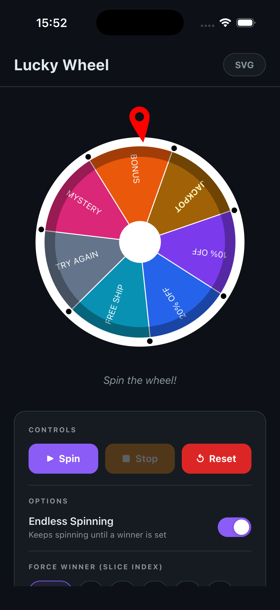
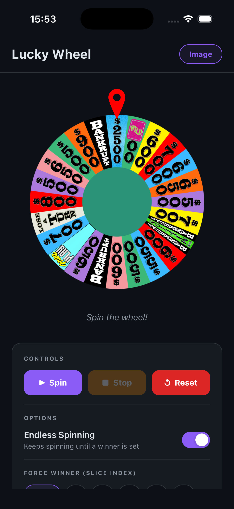

# react-native-lucky-wheel <!-- omit in toc -->

[](https://npmjs.com/package/react-native-lucky-wheel)
[](https://circleci.com/gh/ridvanaltun/react-native-lucky-wheel/tree/master)
[](http://commitizen.github.io/cz-cli/)
[](https://github.com/ridvanaltun/react-native-lucky-wheel/blob/master/LICENSE)

> A customizable lucky wheel component for React Native.

Building a lucky wheel (also known as a `wheel of fortune`) component from scratch can be tedious. This library gives you a ready-to-use implementation so you can ship faster.

## Demo Preview

<p align="center">
  
  
</p>

# Table of Contents <!-- omit in toc -->

- [Demo Preview](#demo-preview)
- [Getting started](#getting-started)
  - [Dependencies](#dependencies)
- [API](#api)
  - [Props](#props)
  - [Methods](#methods)
- [Usage](#usage)
  - [Advance Styling](#advance-styling)
  - [Spin Types: Gesture and Method](#spin-types-gesture-and-method)
  - [Wheel Types: SVG and Image](#wheel-types-svg-and-image)
  - [Endless Spinning](#endless-spinning)
  - [Play Tick Sound](#play-tick-sound)
- [Example App](#example-app)
- [Contributing](#contributing)
- [License](#license)

## Getting started

:warning: it's not tested on field.

```sh
yarn add react-native-lucky-wheel
```

### Dependencies

Install **`react-native-svg`** in your app. This package declares it as a peer dependency with range **`>=12.x`** (see `peerDependencies` in `package.json`). Newer major versions are not capped there; if something breaks on a future major, open an issue.

**Expo**

```sh
expo install react-native-svg
```

(`expo install` picks a version compatible with your SDK.)

**React Native CLI**

```sh
yarn add react-native-svg@^12.0.0
# or
npm install react-native-svg@^12.0.0
```

Use **`^12.0.0`** (or any **12+** release) to satisfy the peer range. You may use a newer major if your app already depends on it and the wheel renders correctly.

Follow the upstream guide for native setup: [react-native-svg](https://github.com/react-native-svg/react-native-svg).

## API

The `<LuckyWheel>` component can take a number of inputs to customize it as needed. They are outlined below:

### Props

| Name                   | Type                                      | Required |            Default Value            |
| :--------------------- | :---------------------------------------- | :------: | :---------------------------------: |
| slices                 | ISlice[]                                  |    +     |                  -                  |
| padAngle               | number                                    |    -     |                0.01                 |
| outerRadius            | number                                    |    -     |                 13                  |
| innerRadius            | number                                    |    -     |                 30                  |
| duration               | number                                    |    -     |                  4                  |
| enableGesture          | boolean                                   |    -     |                false                |
| enablePhysics          | boolean                                   |    -     |                false                |
| enableOuterDots        | boolean                                   |    -     |                true                 |
| gestureType            | GestureType                               |    -     |       GestureTypes.CLOCKWISE        |
| size                   | number                                    |    -     |             width - 40              |
| winnerIndex            | number                                    |    -     |                  -                  |
| minimumSpinVelocity    | number                                    |    -     |                  1                  |
| textStyle              | ITextStyle                                |    -     |                  -                  |
| textAngle              | TextAngleType                             |    -     |         TextAngles.VERTICAL         |
| backgroundColorOptions | RandomColorOptionsSingle                  |    -     | {luminosity: 'dark', hue: 'random'} |
| offset                 | number                                    |    -     |                  0                  |
| backgroundColor        | Color                                     |    -     |               `#FFF`                |
| knobSize               | number                                    |    -     |                 30                  |
| knobColor              | Color                                     |    -     |              `#FF0000`              |
| easing                 | EasingType                                |    -     |           EasingTypes.OUT           |
| dotColor               | Color                                     |    -     |               `#000`                |
| onKnobTick             | () => void                                |    -     |                  -                  |
| onSpinningStart        | () => void                                |    -     |                  -                  |
| onSpinningEnd          | (winner: ISlice) => void                  |    -     |                  -                  |
| source                 | ImageSourcePropType                       |    -     |                  -                  |
| customKnob             | (params: ICustomKnob) => React.ReactChild |    -     |                  -                  |
| customText             | (params: IWheelText) => React.ReactChild  |    -     |                  -                  |
| waitWinner             | boolean                                   |    -     |                false                |
| enableInnerShadow      | boolean                                   |    -     |                true                 |

### Methods

These are the various methods.

| Method | Params | Description     |
| :----- | :----: | :-------------- |
| start  |   -    | Start spinning. |
| stop   |   -    | Stop spinning.  |
| reset  |   -    | Reset spinning. |

## Usage

```jsx
import LuckyWheel from 'react-native-lucky-wheel';

const SLICES = [
  { text: 'foo' },
  { text: 'bar' },
  { text: 'baz' },
  { text: 'qux' },
];

const App = () => {
  return <LuckyWheel slices={SLICES} />;
};
```

### Advance Styling

I added some props to styling the wheel:

`@TODO`

### Spin Types: Gesture and Method

You can spin the wheel with two different method:

`@TODO`

### Wheel Types: SVG and Image

There are two different methods to create a Lucky Wheel:

`@TODO`

### Endless Spinning

If you want to select a winner after spinning begin you can use endless spinning feature of this library.

`@TODO`

### Play Tick Sound

There are some libraries to play sound, I don't want to select one, so I decide to not add this feature. However, you can add this feature by yourself following below instructions:

`@TODO`

## Example App

Preview screenshots are available in the [Demo Preview](#demo-preview) section above:

- [SVG wheel example](docs/svg-example.png)
- [Image wheel example](docs/image-example.png)

```sh
# clone the project
git clone https://github.com/ridvanaltun/react-native-lucky-wheel.git

# go into the project
cd react-native-lucky-wheel

# install dependencies
yarn install

# run the example (Expo)
yarn workspace react-native-lucky-wheel-example start

# run for android
yarn workspace react-native-lucky-wheel-example android

# or

# run for ios
yarn workspace react-native-lucky-wheel-example ios
```

## Contributing

See the [contributing guide](CONTRIBUTING.md) to learn how to contribute to the repository and the development workflow.

## License

[MIT](LICENSE)
